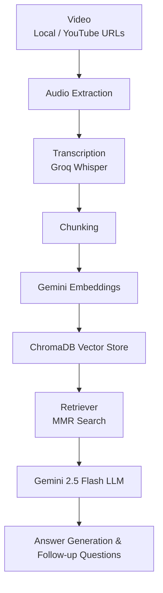

# AI Video Intelligence & Knowledge Synthesis Platform

An AI-powered platform that transforms local and YouTube videos into searchable knowledge using transcription, semantic search, Retrieval-Augmented Generation (RAG), and Gemini-powered  cross-question answering.

## Streamlit - link
   https://ai-video-intelligence-knowledge-synthesis-platform-6rqpdgmav5a.streamlit.app/
##
##  🎥 Demo Video

https://github.com/user-attachments/assets/515e9443-d3f6-4d14-99b4-6e63cc2b28e0

##  Project Features 

- Upload local videos
- Process YouTube videos
- Multilingual Support
- Groq Whisper transcription
- Gemini Embeddings
- ChromaDB Vector Database
- RAG-based Question Answering
- Multi-video processing
- Streamlit Interface

## Tech Stack Used

- Python
- Streamlit
- LangChain
- Gemini 2.5 Flash
- Gemini Embeddings
- ChromaDB
- Groq Whisper
- yt-dlp

##  Project Workflow

##

Author

**Vipul Singh**

linkedin: https://www.linkedin.com/in/vipul-singh-243700282/
